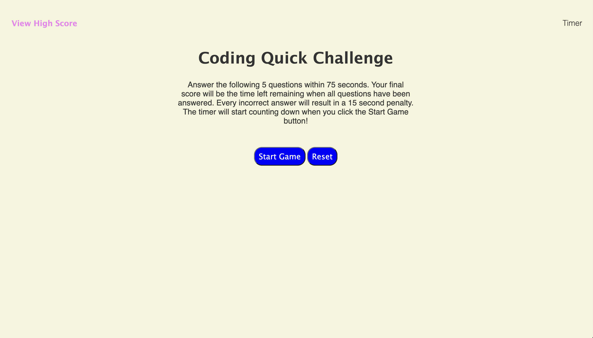
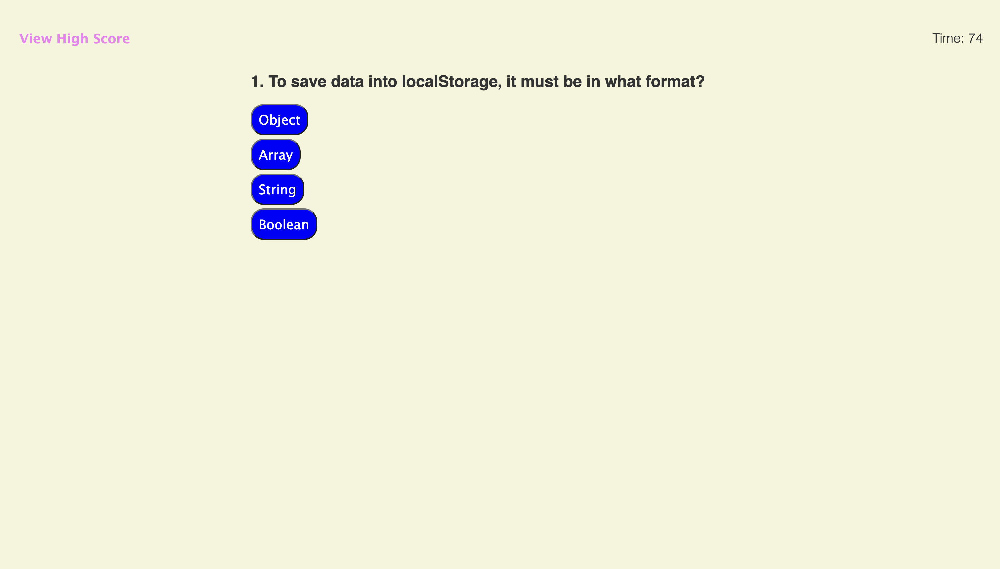
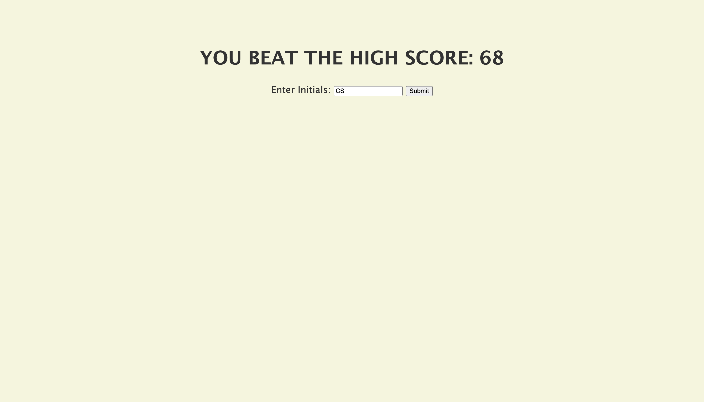
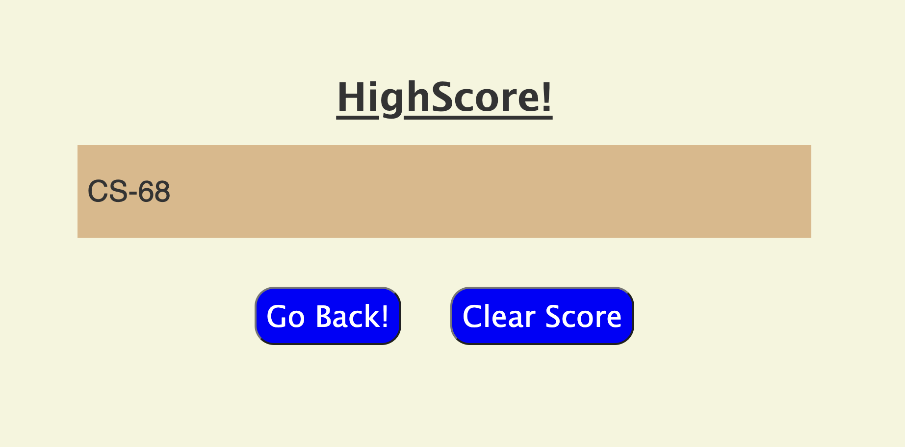

# Quiz-Game

## A user interactive quiz created using HTML, CSS, JavaScript

### Test your knowledge in JavaScript and see if you can beat the high score

The following application is a quiz to test the users JavaScript knowledge. The user is given 75 seconds to finish the quiz and is presented 6 questions. They must answer the questions as fast as possible and correctly. They will be told whether the answer is correct in the feedback section under the question. If a question is answered incorrectly, a 15 second time penalty will be given and deducted from the timer at the top right corner of the page. 

The final score is the amount of time remaining once every question has been answered. If the user sets a high score, they will be asked to provide their initials. Their score and initials will be saved into their local storage, and will be accessible whenever they view the high score page. If the user does not beat the high score they will be presented their score and a button to reset the page and try the quiz again. 

The user has the ability to clear the high score from the local storage and set a new high score with the next game played. 

The following is a live link to the JavaScript Quiz: https://charanvir.github.io/Quiz-Game/

Below is a screenshot of the deployed application:
- 
- 
- 
- 
